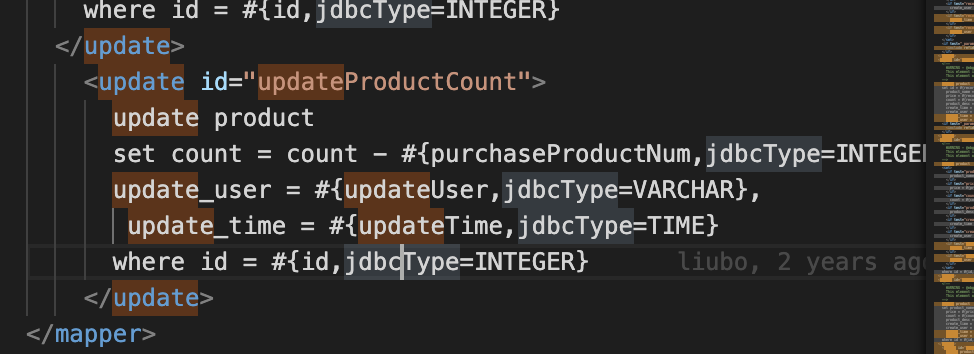
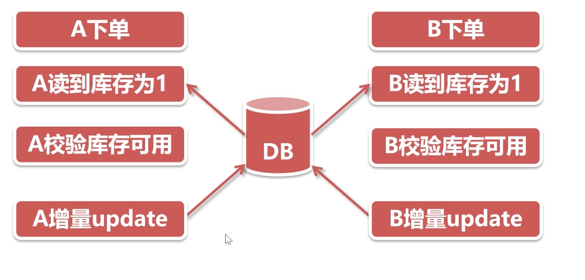
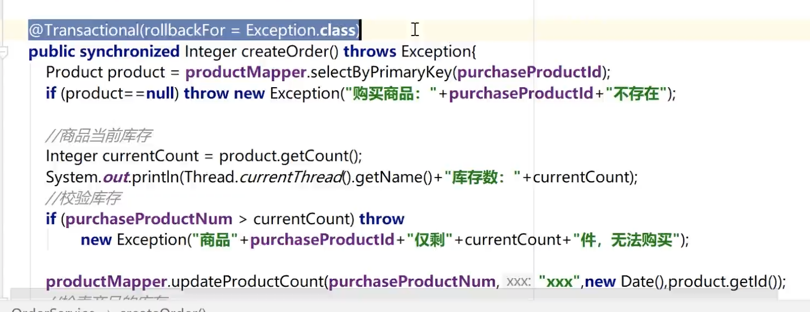

# 天天吃货整合分布式锁

## 1、整合分布式锁
'''update行锁去扣减库存'''
目前在项目中，基于数据库update行锁去扣减库存，这种方案是不错的，完全可以解决超卖的问题，在一般情况下，我们可以大胆使用。

update 要排队的
  


## 库存仅仅为1的情况下, 读取的时候的没有上锁, update的时候没有回滚
  

## 一起读一起取
解决方法 这样不行, 事务还没有提交呢, transaction
  

synchronized怎么写
对象锁 ==> new 出来的, 如果不是单例, this可能有好几个实例, 
  

类锁: 只有1个, 
  


  


如果大家担心在访问量激增的情况下，对数据库压力较大，我们可以使用基于Redis的分布式锁，将压力从数据库层前移到Redis层。Redis在我们的项目中已经存在了，我们不需过多的配置。使用分布式锁呢，我们采用Redisson这个客户端，需要在pom文件中引入。

```xml
<!-- 分布式锁【1】引入 redisson 依赖 -->
<dependency>
    <groupId>org.redisson</groupId>
    <artifactId>redisson-spring-boot-starter</artifactId>
    <version>3.12.0</version>
</dependency>
```

在这里我们采用了Redisson的starter，结合SpringBoot项目，可以快速的启动，无需过多的配置。第二步，我们在`ItemServiceImpl`类中注入Redisson的客户端`RedissonClient`，如下：

```java
//分布式锁【2】自动注入
@Autowired
private RedissonClient redisson;
```

最后，我们在扣减库存时，先获取分布式锁，只有获得锁的请求才能扣减库存，没有获得锁的请求，将等待。**这里我们需要注意的是获取锁时传入的key，这里我们采用的是商品的规格ID，在并发时，规则ID相同时，才会产生等待。**代码如下：

```java
		/**
         *  分布式锁【3】 编写业务代码
         *  1、Redisson是基于Redis，使用Redisson之前，项目必须使用Redis
         *   2、注意getLock方法中的参数，以specId作为参数，每个specId一个key，和
         *   数据库中的行锁是一致的，不会是方法级别的锁
         */
        RLock rLock = redisson.getLock("SPECID_"+specId);
        try {
            /**
             * 1、获取分布式锁，锁的超时时间是5秒get
             *  2、获取到了锁，进行后续的业务操作
             */
            rLock.lock(5, TimeUnit.HOURS);

            int result = itemsMapperCustom.decreaseItemSpecStock(specId, buyCounts);
            if (result != 1) {
                throw new RuntimeException("订单创建失败，原因：库存不足!");
            }
        } catch (Exception e) {
            logger.error(e.getMessage(),e);
            throw new RuntimeException(e.getMessage(),e);
        }finally {
            /**
             *  不管业务是否操作正确，随后都要释放掉分布式锁
             *   如果不释放，过了超时时间也会自动释放
             */
            rLock.unlock();
        }
```

到这里，整合分布式锁就完成了，大家可以测试一下。